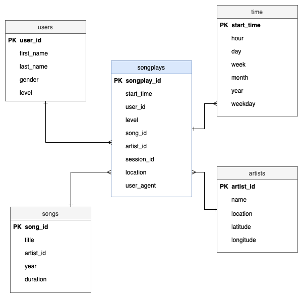

# Sparkify Postgres ETL

## Introduction
A startup called Sparkify wants to analyze the data they've been collecting on songs and user activity on their new music streaming app. The analytics team is particularly interested in understanding what songs users are listening to. Currently, they don't have an easy way to query their data, which resides in a directory of JSON logs on user activity on the app, as well as a directory with JSON metadata on the songs in their app.

The goal of the project is to develop a Postgres Database Schema and ETL pipeline to optimize queries for song play analysis.
    
## Getting Started
Run two files below in the order that they are listed to create the database tables and run the ETL pipeline.

<ol>
<li>python create_tables.py - creates the database tables</li>
<li>python etl.py - fills in tables via ETL - </li>
</ol>

## Database Schema
The schema used for this exercise is the Star Schema. There is one main fact table containing all the measures associated to each event, and 4 dimentional tables, each with a primary key that is being referenced from the fact table. The advantages of Star Schema are performance increase, slicing down and easier understanding of data.

<b>songplays: </b>Records in log data associated with song plays 
<b>users: </b> Users in the app  
<b>songs: </b> Songs in music database  
<b>artists: </b> Artists in music database  
<b>time: </b> Timestamps of records in songplays broken down into specific units  

## ETL
<ol>
<li>Created songs, artist dimension tables from extracting songs_data by selected columns.</li>
<li>Created users, time dimension tables from extracting log_data by selected columns.</li>
<li>Created the most important table fact table from the dimensison tables and log_data called songplays.</li>
</ol>

## Files in the repository
<ol>
<li><b>test.ipnb</b> displays the first few rows of each table to let you check your database</li>

<li><b>create_tables.py</b> drops and created your table</li>

<li><b>etl.ipynb</b> read and processes a single file from song_data and log_data and loads into your tables in Jupyter notebook</li>

<li><b>etl.ipynb</b> read and processes a single file from song_data and log_data and loads into your tables in ET</li>

<li><b>sql_queries.py</b> containg all your sql queries and in imported into the last three files above</li>
</ol>

